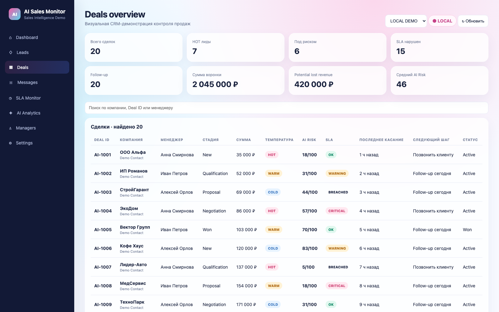
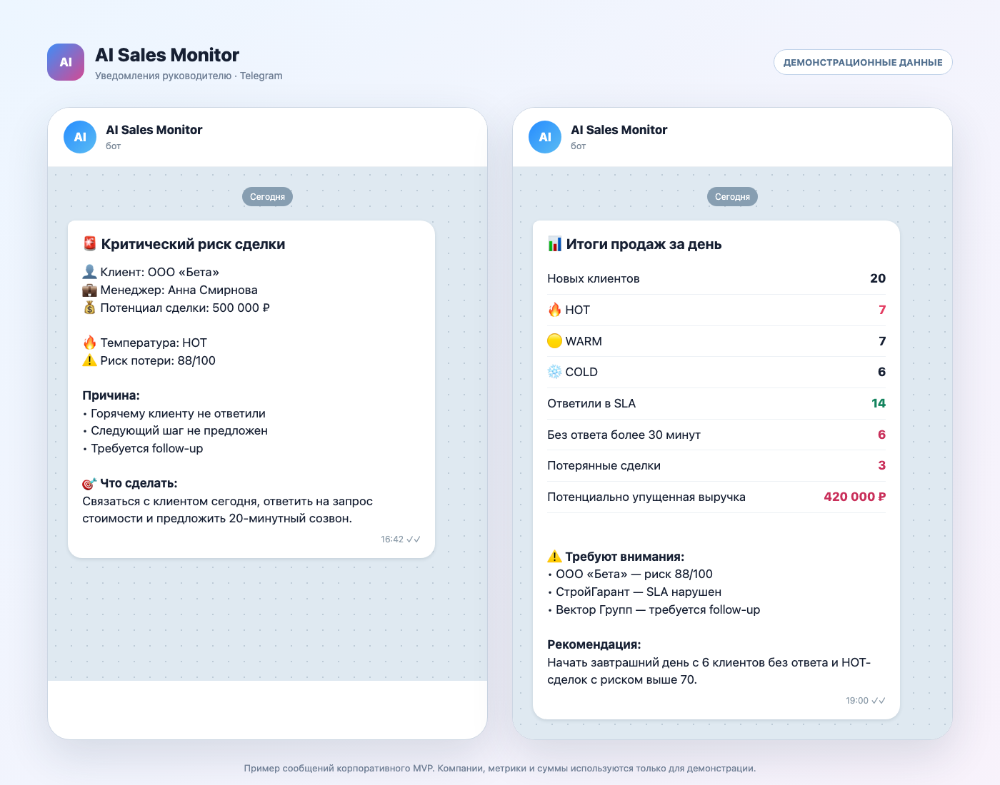
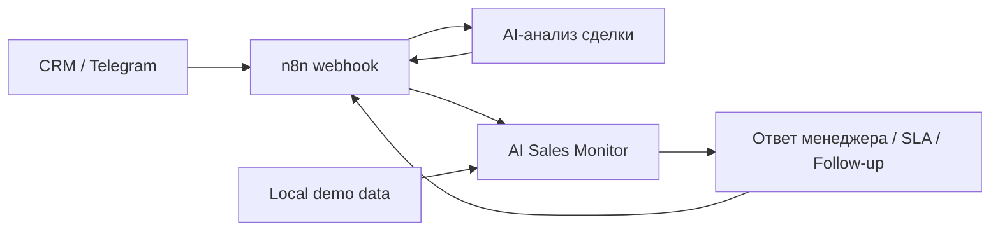

# AI Sales Monitor

[](LICENSE)

Корпоративный MVP для сквозного контроля продаж: Telegram-лиды, переписка, AI Risk, SLA, follow-up, эскалации и вечерняя управленческая отчётность объединены в одном процессе.



## Уведомления руководителю

Система не ограничивается dashboard: она отправляет критические предупреждения по отдельным сделкам и вечернюю управленческую сводку с нарушениями SLA и потенциально упущенной выручкой.



На изображении используются синтетические компании, метрики и суммы. Рабочие Telegram ID и клиентские сообщения в репозиторий не включаются.

## Задача

Менеджеру сложно одновременно контролировать новые сообщения, просроченные ответы, риск потери сделки и следующий шаг по каждому клиенту. AI Sales Monitor собирает эти сигналы в одном интерфейсе и позволяет быстро перейти от общей картины к истории конкретной сделки.

## Что реализовано

- 20 автономных демонстрационных сделок без внешних сервисов;
- KPI по воронке, HOT-лидам, риску, SLA и follow-up;
- поиск по компании, Deal ID и менеджеру;
- карточка сделки с коммуникациями и CRM-событиями;
- симуляция сообщения клиента, ответа менеджера и нарушения SLA;
- нормализация данных между CRM и интерфейсом;
- запуск AI-анализа через n8n в приватном live-режиме;
- автоматическое создание лида из Telegram и уведомление менеджера;
- фиксация переписки клиента и менеджера в карточке сделки;
- контроль отсутствия ответа более 30 минут;
- критические уведомления и ежедневный отчёт директору;
- автоматический fallback в Local Demo;
- автоматические проверки синтаксиса, ресурсов и публичной конфигурации.

## Архитектура



Полная архитектура и жизненный цикл лида описаны в [docs/architecture.md](docs/architecture.md), каталог n8n-сценариев — в [docs/workflows.md](docs/workflows.md), эксплуатационные процедуры — в [docs/operations.md](docs/operations.md).

Публичная версия работает на локальных демонстрационных данных. Рабочие n8n credentials, webhook endpoint и клиентские данные намеренно не публикуются.

## Демонстрационный сценарий

1. Откройте таблицу сделок и найдите клиента через поиск.
2. Нажмите на строку, чтобы открыть карточку сделки.
3. Добавьте сообщение клиента — температура, риск и follow-up обновятся.
4. Нажмите `Simulate SLA Breach`, чтобы увидеть реакцию показателей.
5. Отправьте ответ менеджера — SLA вернётся в `OK`, ожидание и follow-up будут сняты.

Изменения в Local Demo хранятся в памяти страницы и сбрасываются после обновления.

## Режимы работы

| Режим | Назначение | Внешние сервисы | Данные |
|---|---|---|---|
| Local Demo | Публичная демонстрация интерфейса и бизнес-логики | Не нужны | Встроенные синтетические |
| n8n Live | Интеграция с CRM и AI workflow | Приватный n8n webhook | Данные подключённой CRM |

## Быстрый запуск

```bash
git clone https://github.com/guzkarimova/ai-sales-monitor.git
cd ai-sales-monitor
python3 -m http.server 8000
```

Откройте `http://localhost:8000`. По умолчанию используется Local Demo.

## Приватное подключение n8n

```bash
cp config.local.example.js config.local.js
```

Укажите адрес собственного webhook в `config.local.js`. Файл исключён из Git и подключается только локально.

Поддерживаемые события: `health_check`, `get_deals`, `new_client_message`, `manager_reply`, `sla_breach`, `change_stage`, `request_ai_analysis`.

Production endpoint должен проверять авторизацию, ограничивать CORS, валидировать входные данные, применять rate limiting и возвращать только разрешённые поля.

## Проверка

Требуется Node.js 20+, установка зависимостей не нужна:

```bash
npm run check
```

## Структура

```text
├── docs/                # визуальная документация
├── tests/               # проверки проекта
├── index.html           # CRM-интерфейс
├── styles.css           # дизайн
├── data.js              # синтетические сделки
├── config.js            # безопасная публичная конфигурация
├── config.local.example.js
└── app.js               # UI и бизнес-логика
```

## Статус продукта

Корпоративный MVP завершён: Local Demo, приватный n8n-контур, Telegram-сценарии, SLA-контроль, отчётность, документация и тесты образуют единый демонстрационный продукт. Репозиторий не утверждает, что система уже эксплуатируется конкретной компанией. Для production-развёртывания необходимы защищённая авторизация webhook, постоянное хранилище, аудит, мониторинг и формальная проверка обработки персональных данных.

## Лицензия

[MIT](LICENSE)
