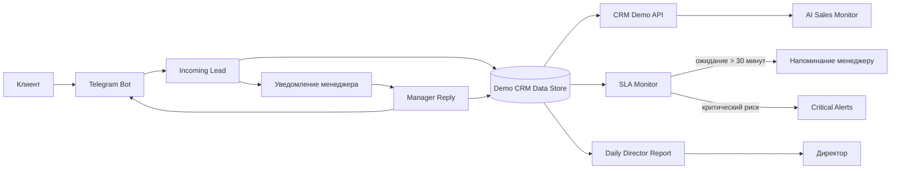

# Архитектура AI Sales Monitor

## Контур системы

## Жизненный цикл лида

1. Клиент отправляет сообщение Telegram-боту.
2. `Incoming Lead` создаёт или обновляет сделку и фиксирует коммуникацию.
3. Сделке назначаются менеджер, температура, AI Risk и следующий шаг.
4. Менеджер получает уведомление о новом обращении.
5. Ответ менеджера проходит через `Manager Reply`, отправляется клиенту и записывается в историю.
6. `SLA Monitor` контролирует время с последнего сообщения клиента.
7. При превышении 30 минут создаётся SLA-событие и отправляется напоминание.
8. `Critical Alerts` эскалирует сделки с высоким риском или негативным сигналом.
9. В конце рабочего дня `Daily Director Report` агрегирует показатели и отправляет отчёт руководителю.

## Модель сделки

| Поле | Назначение |
|---|---|
| `deal_id` | Уникальный идентификатор сделки |
| `company`, `contact_name` | Клиент и контакт |
| `manager_id`, `manager_name` | Ответственный менеджер |
| `stage`, `status` | Стадия и состояние сделки |
| `deal_value` | Потенциальная выручка |
| `lead_temperature` | `HOT`, `WARM` или `COLD` |
| `ai_risk_score` | Риск потери от 0 до 100 |
| `sla_status`, `waiting_minutes` | Состояние SLA |
| `follow_up_required` | Требуется ли следующий контакт |
| `communications` | История сообщений клиента и менеджера |
| `events` | Аудит событий CRM и автоматизации |

## Границы публичного репозитория

Публично доступны интерфейс, локальная бизнес-логика, синтетические данные, тесты и контракты. Приватно остаются n8n instance, credentials, Telegram-токены, идентификаторы получателей, рабочие webhook URL и реальные сообщения клиентов.

